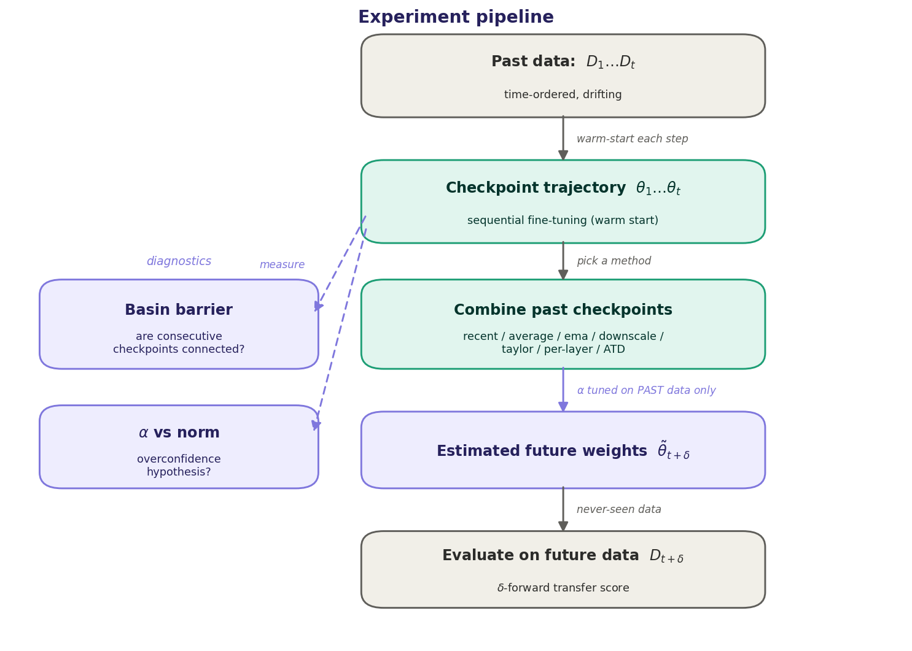
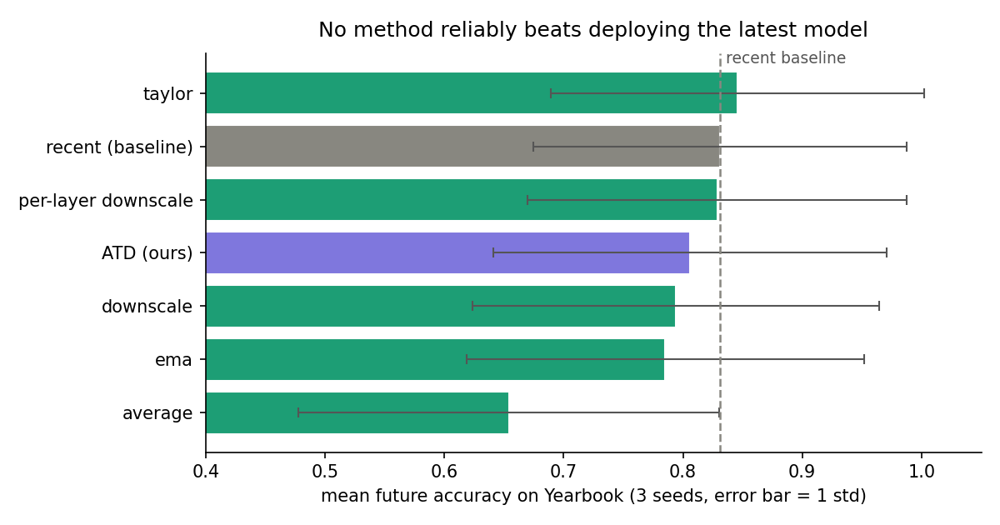

# Temporal Generalization: A Reality Check — a reproduction, and an idea of my own

This is my reproduction of Madaan, Chopra & Cho, *Temporal Generalization: A Reality Check* ([ICLR 2026](https://arxiv.org/abs/2509.23487); official code [divyam3897/TG](https://github.com/divyam3897/TG)), scaled down to run on a laptop. I built it because the paper's result surprised me and I wanted to watch it fail for myself. Once the reproduction was working I added a method of my own and two diagnostics that *measure* the reasons the paper gives for the failure, instead of taking them on faith.

The question the paper asks is a tempting one. Models rot as the world drifts, and retraining is expensive, so — given a history of past checkpoints and no access to the future — can you compute a set of weights that will hold up on data you haven't seen yet? It sorts the candidate tricks into two families: interpolation (average or blend past checkpoints, or shrink the most recent one toward zero) and extrapolation (project the parameter trajectory forward with a Taylor step). The catch, and the whole point of the paper, is a strict rule that a lot of earlier work quietly breaks: you may not use the future for anything, not even to pick a hyperparameter. Under that rule, none of the tricks reliably beat the trivial baseline of just deploying the most recent model.

## The experiment at a glance



The whole thing hangs off one object — a trajectory of checkpoints trained one timestep at a time. From the past checkpoints I build a "future" estimate with each method (tuning any knob on past data only), score it on genuinely unseen future data, and separately run two diagnostics off the same trajectory to test the paper's explanations for why it all fails.

## What I found



The headline reproduced cleanly. On Yearbook, across three seeds, nothing beat the most-recent-model baseline. Taylor extrapolation edged ahead by about 1.5 points, but that gap sits well inside a 15-point standard deviation, so it's noise — which is exactly the mirage the paper is warning people about, and a nice reminder of why the error bars matter.

The part I didn't expect is that the two explanations the paper gives for *why* these methods fail don't actually hold up on Yearbook:

- The loss barrier between consecutive checkpoints is basically flat (about 0.003). That means the checkpoints sit in connected regions of the loss surface, not the disconnected "basins" the paper points to — and yet the methods still fail.
- The correlation that the "parameters grow overconfident, so shrinking helps" story says should be *negative* came out mildly positive (r ≈ +0.15).

So the methods fail even though neither of the intuitive reasons applies here. To me that makes the paper's deeper claim land harder than just reading it did: without some assumption about how the data changes over time, the future can be arbitrary, and no clever averaging of past weights recovers it.

## How the setup works

Everything is built on one object: a trajectory of checkpoints. I train the model one timestep at a time, and each timestep is warm-started from the previous one (sequential fine-tuning / continual learning, the paper's Eq. 5). This matters — if you trained each timestep from scratch, the checkpoints would land in unrelated parts of weight space and interpolating between them would be meaningless. Warm-starting keeps consecutive checkpoints close enough that interpolation and extrapolation are at least well-defined.

From that trajectory I estimate a "future" set of weights and score it with δ-forward transfer: at each time *t* I build an estimate from the checkpoints up to *t*, then evaluate it on data from *t + δ* for δ = 1, 2, 3. That's genuinely future data the estimate never touched.

The hyperparameter tuning is the piece I was most careful about, because it's where the paper says other work cheats. To choose a knob (like a downscaling factor) at time *t*, the code simulates a decision I *could* have made one horizon earlier: it builds a candidate from checkpoints up to *t − δ* and scores it on the now-current data at *t*, then applies the winning value going forward. There is an assertion in the code that makes it structurally impossible for the tuner to index a future timestep. That's the honesty guarantee the whole paper hinges on, written so a reader can check it in a few lines.

## The methods I compared

All of them are pure operations on the past parameter vectors (`src/tg/methods.py`):

- `recent` — just deploy the latest checkpoint. The baseline everything has to beat.
- `average` — a uniform mean of all past checkpoints.
- `ema` — an exponentially weighted average that leans on recent checkpoints.
- `downscale` — keep the latest checkpoint but scale its magnitude toward zero (the paper's one method that sometimes helps).
- `taylor` — a first-order extrapolation along the most recent parameter change.
- `per_layer_downscale` — my first extension (below).
- `aniso_downscale` — my original method, ATD (below).

## My first extension: per-layer downscaling

The paper's downscaling shrinks the whole model by a single scalar, arguing it works because the parameter norm grows over training ("overconfidence"). But that growth isn't uniform — some layers barely move while others blow up. So I made the shrink factor per-layer, weighting each layer by how much its norm actually grew, while still tuning a single global scalar on past data only. When every layer grows equally it collapses back to plain downscaling (there's a unit test for exactly that). On Yearbook it didn't beat the baseline — an honest negative, and on-brand for a paper about being skeptical of improvements.

## My original method: Anisotropic Trajectory Downscaling (ATD)

This is the idea I most wanted to try. Plain downscaling assumes the model's overconfidence is spread evenly across all directions. My hunch was that it isn't — the model's recent, present-specific adaptation should live in the handful of directions it *most recently moved in*. So ATD finds that "recency subspace" (the top-*k* principal directions of the last few parameter updates, via an SVD), projects the latest weights onto it, and shrinks only that component, leaving the rest of the model untouched:

```
theta_tilde = theta_t - (1 - beta) * P_recency(theta_t)
```

β = 1 gives back the recent model; if the subspace were the whole space it would reduce to ordinary downscaling. Unlike the paper's methods this isn't a blend of checkpoints at all — it's a directed rescaling of one subspace, so it sits outside their interpolation/extrapolation family. On Yearbook it didn't beat the baseline either, but that's informative: it says the vision failure isn't a tidy low-dimensional "recent-direction" overfit you can undo with a targeted shrink. Both limiting cases are pinned down by unit tests in `tests/test_methods.py`.

## The two diagnostics (measuring the "why")

The paper *asserts* two mechanisms for the failure; I wanted to *measure* them.

The **basin-barrier diagnostic** (`trajectory_barriers` in `src/tg/analysis.py`) walks the straight line in weight space between two consecutive checkpoints, interpolating both the parameters and the batch-norm buffers, and records how high the loss climbs above the straight line joining the two endpoints. A flat path means the two solutions are connected and interpolation is meaningful; a big hump means they're in separate basins and no averaging can help. On Yearbook the path is flat, which is what told me "disconnected basins" isn't the explanation here.

The **α-vs-norm test** pairs each past-only-tuned downscaling factor with the parameter norm at that timestep. If the overconfidence story is right, a larger norm should call for a smaller factor (more shrink), i.e. a negative correlation. On Yearbook it came out slightly positive, so the story doesn't hold up on this data.

Both write plots and CSVs into `results/` when you run the experiment (`fig_barriers.png`, `fig_loss_path.png`, `fig_alpha_norm.png`, `basin_barriers.csv`).

## Experiments

I ran three things, in order of how much I trust them.

**1. Synthetic sanity check.** A self-contained stream of drifting 32×32 image tasks (no download) that I use to confirm the whole pipeline works end-to-end, and to sanity-check that the past-only tuning behaves. On this controlled drift, Taylor extrapolation already lands at or below the recent baseline — a small preview of the real result.

**2. Yearbook reproduction.** The real Wild-Time Yearbook benchmark (portraits by year, predict gender), small CNN, sequential fine-tuning, 3 seeds, evaluated at δ = 1, 2, 3. Mean ± std future accuracy:

| method | mean ± std | vs. recent |
|---|---|---|
| taylor (extrapolation) | 0.846 ± 0.156 | +0.015 (inside the noise) |
| **recent (baseline)** | **0.831 ± 0.157** | — |
| per-layer downscale | 0.829 ± 0.159 | ≤ recent |
| **ATD (mine)** | 0.806 ± 0.165 | ≤ recent |
| downscale | 0.794 ± 0.170 | ≤ recent |
| ema | 0.785 ± 0.166 | ≤ recent |
| average | 0.654 ± 0.176 | ≤ recent |

Nothing clears the baseline once the error bars are in the picture. Taylor's small lead is roughly a tenth of its own standard deviation, so I read it as noise, not a win.

**3. Diagnostics.** Off the same trajectory: the mean basin barrier between consecutive checkpoints is ≈ 0.003 (connected, not disconnected), and the α-vs-norm correlation is ≈ +0.15 (the wrong sign for the overconfidence story). Both are the "why" experiments, and both say the paper's stated mechanisms don't explain the failure on this dataset.

Reproduce the headline numbers with `python run.py --dataset yearbook --epochs 5 --device mps --seeds 0 1 2`.

## Running it

```bash
pip install -r requirements.txt

# quick check that the whole pipeline works (under a minute, no download):
python run.py --smoke-test

# the self-contained synthetic benchmark, 3 seeds with error bars:
python run.py --dataset synthetic --T 8 --epochs 3 --seeds 0 1 2

# the real Yearbook reproduction (downloads the Wild-Time data on first run):
pip install wild-time-data
python run.py --dataset yearbook --epochs 5 --device mps --seeds 0 1 2
```

Every run writes to `results/`: a per-method mean ± std table (`summary_by_method.csv`), the full per-seed/per-δ numbers (`forward_transfer.csv`), the basin barriers, the layer-growth summary, a `run_meta.json` recording the exact config, package versions, git commit and wall-clock time, and the figures above. The console prints the ranked table, an explicit "does anything beat recent?" verdict, the α-vs-norm correlation, and the mean basin barrier.

There's also a torch-free logic mirror (`tools/verify_logic_numpy.py`) that re-runs the whole pipeline — trajectory, past-only tuning, forward transfer, ATD, the barrier — on a tiny model with no GPU, so the logic can be checked anywhere. Unit tests: `pytest -q`.

## Repository layout

```
run.py                      # entry point (--smoke-test / --dataset / --device / --seeds)
src/tg/
  utils.py                  # seeding, device, flat parameter-vector <-> model
  model.py                  # small CNN for 32x32x1 images
  data.py                   # synthetic drifting stream + Wild-Time Yearbook loader
  methods.py                # recent / average / ema / downscale / taylor / per-layer / ATD
  engine.py                 # sequential training, past-only tuning, forward transfer
  analysis.py               # norm trajectories, per-layer growth, PCA, basin barriers, alpha-norm
  plots.py                  # figure generation
tests/test_methods.py       # unit tests for the method math and the ATD limiting cases
tools/verify_logic_numpy.py # torch-free check of the whole pipeline
```

## A note on honesty

This is a scaled reproduction, not a carbon copy. It uses a small CNN and a couple of the paper's tasks (Yearbook, plus a synthetic drifting stream I use for fast checks), so I'm matching the paper's qualitative story rather than its exact numbers. The step I'd most like to take next is a language track — the paper's most interesting contrast is that shrinking helps text but not vision, and comparing basin barriers across the two modalities would be a direct test of the explanation.

Everything I concluded is written up plainly in `ONE_PAGER.md` (also as a PDF) and in more detail in `FINDINGS.md`.

## Citation

```
@inproceedings{madaan2026temporal,
  title={Temporal Generalization: A Reality Check},
  author={Madaan, Divyam and Chopra, Sumit and Cho, Kyunghyun},
  booktitle={ICLR},
  year={2026}
}
```

MIT License.
